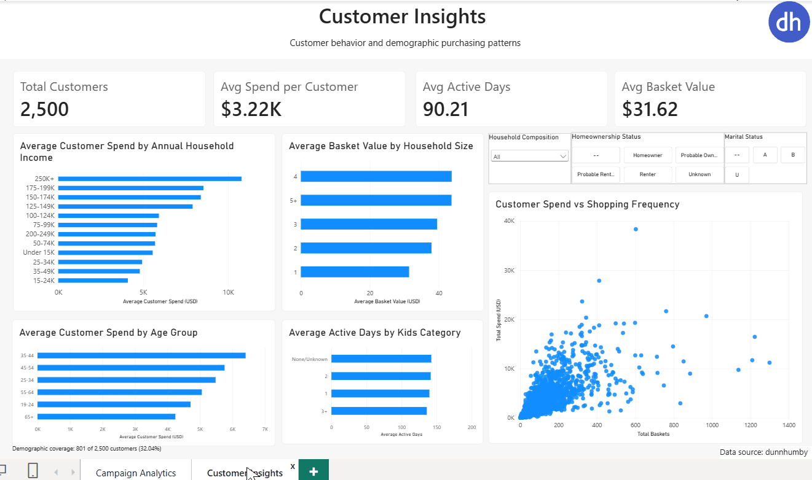
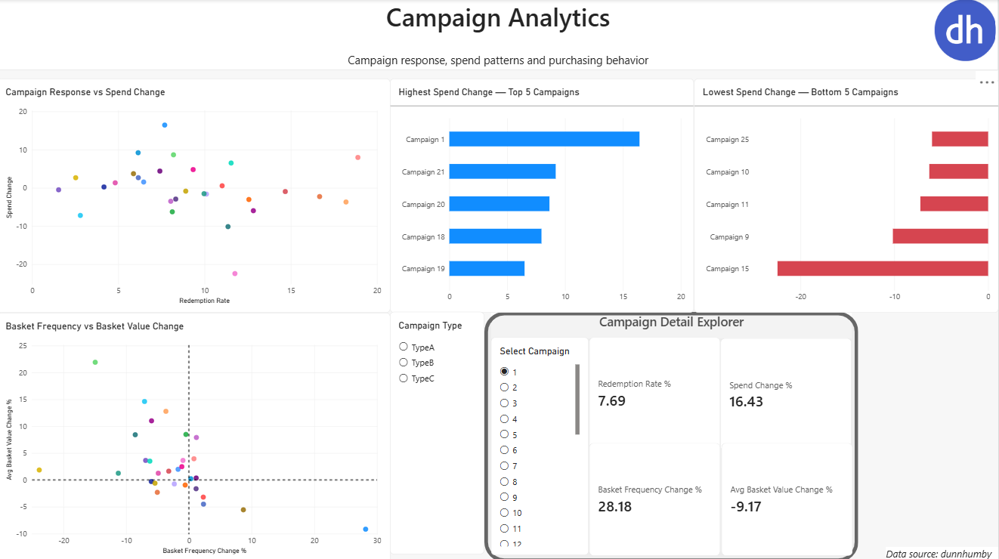
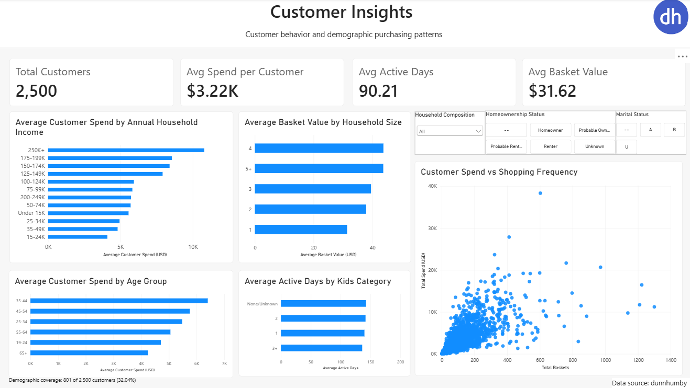

# Consumer Analytics Data Platform

An end-to-end consumer analytics data platform built with **Databricks, PySpark, SQL, Delta Lake, Unity Catalog, and Power BI**.

The project transforms raw retail transaction, customer, product, campaign, and coupon data into analytics-ready datasets using a **Medallion Architecture (Bronze → Silver → Gold)**.

The final Gold layer supports customer behavior analysis, campaign analysis, and behavioral comparisons between campaign periods and equivalent pre-campaign periods. Power BI provides the final interactive analytics and reporting layer.

---

## 📊 Dashboard Demo



The Power BI report contains two interactive analytical views:

- **Campaign Analytics** — campaign response, spend change, shopping frequency, and average basket value patterns.
- **Customer Insights** — customer purchasing behavior and demographic purchasing patterns.

The Power BI project file is available here:

📊 [Download Power BI Dashboard](dashboard/Consumer_Analytics_Dashboard.pbix)

---

## 🏗️ Architecture

```text
Raw CSV Data
     │
     ▼
┌─────────────┐
│   Bronze    │
│ Raw Delta   │
└──────┬──────┘
       │
       ▼
┌─────────────┐
│   Silver    │
│ Cleaned &   │
│ Standardized│
└──────┬──────┘
       │
       ▼
┌──────────────────────────┐
│          Gold            │
│                          │
│ Customer 360             │
│ Campaign Performance     │
│ Behavioral Signals       │
└────────────┬─────────────┘
             │
             ▼
         Power BI
```

The pipeline separates ingestion, transformation, analytical modeling, and visualization responsibilities across layers.

---

# 💡 Business Questions

The analytical layer was designed to support questions such as:

- How do customers differ in spend, shopping frequency, and basket value?
- How is campaign engagement distributed across campaigns?
- What proportion of assigned households redeem campaign coupons?
- How does purchasing behavior differ between campaign periods and equivalent pre-campaign periods?
- Are changes in spend associated with changes in shopping frequency or average basket value?
- How do available demographic groups differ in purchasing behavior?

---

# Data Pipeline

## 1. Source Profiling & Data Quality

📓 **Notebook:** [01_Source_Profiling_and_Data_Quality](notebooks/01_Source_Profiling_and_Data_Quality)

Before building the pipeline, the source datasets are profiled to understand their structure, quality, and analytical limitations.

The profiling process examines:

- dataset grain
- primary and composite keys
- duplicate records
- null values
- referential integrity
- transaction ranges and distributions
- demographic coverage
- campaign observation windows

### Key Findings

The transaction dataset contains approximately **2.6 million transaction lines** across **2,500 purchasing households**.

One important issue identified during profiling was **5,164 redundant duplicate coupon records**. These records are intentionally preserved in the raw Bronze layer and removed during Silver transformations.

Referential integrity checks across products, campaigns, coupons, and coupon redemptions showed no missing references.

The demographic dataset contains information for **801 of the 2,500 purchasing households (32.04%)**.

Therefore:

- behavioral analysis can use all 2,500 purchasing households
- demographic analysis is limited to the 801 households with available demographic information

Unusually high transaction quantities were also investigated. These observations were associated with categories such as gasoline and miscellaneous sales rather than clear data corruption, so they were retained.

---

## 2. Bronze Layer

📓 **Notebook:** [02_Bronze_Layer_Ingestion](notebooks/02_Bronze_Layer_Ingestion)

The Bronze layer represents the raw ingestion stage of the pipeline.

Source CSV files are ingested using **PySpark** and stored as managed **Delta tables** in Unity Catalog.

Bronze preserves the original source data while adding ingestion metadata such as:

- source file
- ingestion timestamp

The following source datasets are ingested:

- transactions
- products
- household demographics
- campaign definitions
- campaign household assignments
- coupons
- coupon redemptions

The Bronze layer acts as the reproducible raw-data foundation for downstream transformations.

---

## 3. Silver Layer

📓 **Notebook:** [03_Silver_Transformations](notebooks/03_Silver_Transformations)

The Silver layer performs cleaning and standardization while preserving the business meaning of the original data.

Transformations include:

- removing redundant coupon duplicates
- standardizing text fields
- deriving transaction hour and minute from transaction time
- adding processing metadata
- validating row counts after transformations

Coupon records are reduced from **124,548 to 119,384 rows**, removing the **5,164 redundant duplicate records** identified during source profiling.

Transaction quantity values are intentionally not globally capped or removed because quantity has different meanings across product categories.

This avoids applying arbitrary cleaning rules that could remove legitimate business observations.

---

## 4. Gold Layer

The Gold layer uses **SQL** to transform standardized Silver datasets into reusable analytical models.

Three analytical components are created:

1. Customer 360
2. Campaign Performance
3. Campaign Behavioral Signals & Growth Analysis

---

### Customer 360

📓 **Notebook:** [04_Customer_360](notebooks/04_Customer_360)

**Grain: one row per household**

The Customer 360 model consolidates customer purchasing behavior, campaign engagement, coupon activity, and available demographic attributes.

Customer-level metrics include:

- total spend
- total baskets
- transaction lines
- distinct products
- active shopping days
- first purchase day
- last purchase day
- average basket value
- campaigns assigned
- coupon redemption events
- distinct coupons redeemed
- demographic attributes where available

All one-to-many sources are aggregated to customer grain **before joining**.

This prevents join fanout and ensures that customer-level metrics remain analytically valid.

The final model contains **2,500 unique purchasing households**.

---

### Campaign Performance

📓 **Notebook:** [05_Campaign_Analysis](notebooks/05_Campaign_Analysis)

**Grain: one row per campaign**

The Campaign Performance model summarizes campaign participation and coupon engagement.

Metrics include:

- households assigned
- households redeemed
- coupon redemption events
- distinct coupons redeemed
- redemption rate
- average customer spend
- average customer baskets
- average customer basket value
- average customer active days

The model contains **30 campaigns**.

Customer purchasing metrics in this dataset describe the overall behavioral profile of households assigned to each campaign and are not interpreted as campaign-caused outcomes.

---

### Campaign Behavioral Signals & Growth Analysis

📓 **Notebook:** [06_Growth_Opportunities](notebooks/06_Growth_Opportunities)

The final analytical stage investigates how purchasing behavior differs around campaign periods.

For each campaign, customer purchasing behavior during the campaign is compared with an **equal-length period immediately before the campaign**.

The analysis calculates:

- spend change %
- basket frequency change %
- average basket value change %

This allows changes in customer spend to be decomposed into different purchasing patterns.

For example, higher spend may occur alongside:

- more frequent shopping
- higher average basket value
- or a combination of both

The final analytical view combines these behavioral signals with campaign engagement metrics such as coupon redemption rate.

### Observation Window Validation

The transaction dataset ends on **Day 711**.

One campaign extends beyond this observation window:

- **Campaign 24 ends on Day 719**

Campaign 24 is therefore flagged as having an **incomplete observation window** and is excluded from comparative campaign visuals where appropriate.

> **Analytical note:** Campaign-period comparisons are descriptive. Without a comparable control group, observed behavioral changes should not be interpreted as causal campaign impact.

---

# 📊 Power BI Analytics

The Gold analytical layer is connected to **Power BI through Databricks SQL**.

Power BI acts as the presentation and exploration layer, while data preparation and analytical modeling remain within the Databricks pipeline.

The report contains two pages:

- Campaign Analytics
- Customer Insights

---

## Campaign Analytics



The **Campaign Analytics** page explores relationships between campaign engagement and customer purchasing behavior.

### Main Visualizations

**Campaign Response vs Spend Change**

Compares coupon redemption rate with changes in customer spending during campaign periods.

**Highest Spend Change — Top 5 Campaigns**

Highlights campaigns associated with the largest positive spend changes.

**Lowest Spend Change — Bottom 5 Campaigns**

Highlights campaigns associated with the largest negative spend changes.

**Basket Frequency vs Basket Value Change**

Shows whether changes in spend occur alongside changes in:

- shopping frequency
- average basket value

### Interactive Campaign Explorer

Users can select individual campaigns and inspect:

- Redemption Rate %
- Spend Change %
- Basket Frequency Change %
- Average Basket Value Change %

Campaign Type can also be used as a global filter across the analytical page.

Campaign 24 is excluded from comparative campaign visuals because its observation window extends beyond the available transaction data.

---

## Customer Insights



The **Customer Insights** page explores purchasing behavior across the customer base and available demographic groups.

### Customer KPIs

The dashboard provides headline metrics for:

- Total Customers
- Average Spend per Customer
- Average Active Days
- Average Basket Value

Across the full customer population:

- **2,500 purchasing households**
- **$3.22K average spend per customer**
- **90.21 average active days**
- **$31.62 average basket value**

### Demographic Analysis

Available demographic attributes are used to explore:

- average customer spend by annual household income
- average customer spend by age group
- average basket value by household size
- average active days by kids category

Interactive filters allow exploration by:

- household composition
- homeownership status
- marital status

### Customer Behavior

The **Customer Spend vs Shopping Frequency** scatter plot explores the relationship between:

- total baskets
- total customer spend

Additional customer metrics are available through interactive tooltips.

### Demographic Coverage

Demographic information is available for:

**801 of 2,500 customers (32.04%)**

Therefore, demographic visualizations represent the available demographic subset, while overall behavioral KPIs use the complete purchasing population.

---

# ⚠️ Analytical Considerations

Several design decisions were made to avoid misleading conclusions.

### Campaign Analysis Is Descriptive

Campaign-period behavior is compared with an equal-length pre-campaign period.

However, no comparable untreated control group is available.

The analysis therefore identifies **behavioral signals and associations**, not causal campaign impact.

### Demographic Coverage Is Limited

Demographic information is available for only **32.04% of purchasing households**.

Demographic comparisons therefore represent this subset rather than the complete customer population.

### Quantity Is Category-Dependent

Raw transaction quantity is not treated as a universal purchasing-volume metric because its meaning differs significantly across product categories.

Metrics such as:

- spend
- baskets
- active days
- distinct products

are therefore preferred for general customer behavioral analysis.

### Grain Is Explicitly Controlled

Gold models maintain clearly defined grains:

- Customer 360 → one row per household
- Campaign Performance → one row per campaign
- Campaign Behavioral Signals → one row per campaign

One-to-many sources are aggregated before joining to prevent metric inflation through join fanout.

---

# 🛠️ Technologies

| Technology | Usage |
|---|---|
| **Databricks** | Data engineering and analytics environment |
| **Apache Spark / PySpark** | Data ingestion and transformations |
| **SQL** | Gold analytical modeling |
| **Delta Lake** | Analytical table storage |
| **Unity Catalog** | Data organization and governance |
| **Power BI** | Interactive dashboards and reporting |
| **Git / GitHub** | Version control and project management |

---

# 📁 Repository Structure

```text
Consumer_Analytics_Data_Platform/
│
├── notebooks/
│   ├── 01_Source_Profiling_and_Data_Quality
│   ├── 02_Bronze_Layer_Ingestion
│   ├── 03_Silver_Transformations
│   ├── 04_Customer_360
│   ├── 05_Campaign_Analysis
│   └── 06_Growth_Opportunities
│
├── dashboard/
│   └── Consumer_Analytics_Dashboard.pbix
│
├── images/
│   ├── campaign_analytics_dashboard.png
│   ├── consumer_analytics_dashboard_demo.gif
│   └── customer_insights_dashboard.png
│
└── README.md
```

---

# 📚 Dataset

This project uses the **dunnhumby – The Complete Journey** retail dataset, obtained from Kaggle.

🔗 **Data Source:** [dunnhumby – The Complete Journey | Kaggle](https://www.kaggle.com/datasets/frtgnn/dunnhumby-the-complete-journey)

The dataset contains multiple interconnected retail datasets, including:

- household transactions
- products
- household demographics
- campaigns
- campaign assignments
- coupons
- coupon redemptions

These datasets provide the foundation for building the Bronze, Silver, and Gold analytical layers used throughout the project.

The dataset is used for **educational and portfolio purposes**.
---

# 🚀 Project Outcome

This project demonstrates an end-to-end analytics workflow covering:

**Source Profiling → Data Quality → PySpark Ingestion → Delta Lake → Medallion Architecture → SQL Analytical Modeling → Power BI**

Rather than performing analysis directly on raw files, the project builds reusable Bronze, Silver, and Gold data layers before exposing analytics-ready datasets to Power BI.

The result is a reproducible consumer analytics platform that combines **data engineering, analytical modeling, data quality validation, and business intelligence** in a single project.